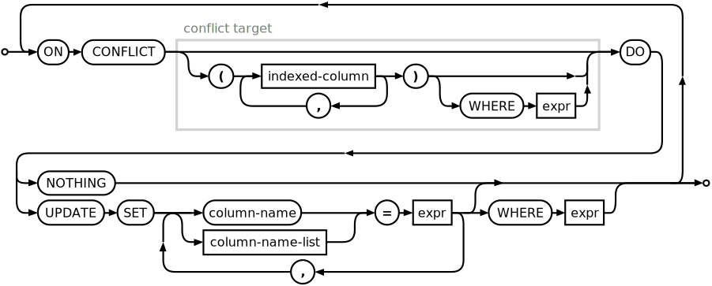

# 𓆤DBay


<!-- START doctoc generated TOC please keep comment here to allow auto update -->
<!-- DON'T EDIT THIS SECTION, INSTEAD RE-RUN doctoc TO UPDATE -->
**Table of Contents**  *generated with [DocToc](https://github.com/thlorenz/doctoc)*

- [𓆤DBay](#%F0%93%86%A4dbay)
  - [Introduction](#introduction)
  - [Documentation](#documentation)
    - [Main](#main)
      - [Using Defaults](#using-defaults)
      - [Automatic Location](#automatic-location)
      - [Randomly Chosen Filename](#randomly-chosen-filename)
      - [Using Parameters](#using-parameters)
    - [Opening and Closing DBs](#opening-and-closing-dbs)
      - [Opening / Attaching DBs](#opening--attaching-dbs)
      - [Closing / Detaching DBs](#closing--detaching-dbs)
    - [Transactions and Context Handlers](#transactions-and-context-handlers)
    - [Query](#query)
      - [Use the `alt`ernative Connection to Avoid Connection Busy Errors](#use-the-alternative-connection-to-avoid-connection-busy-errors)
      - [`SQL` Tag Function for Better Embedded Syntax](#sql-tag-function-for-better-embedded-syntax)
      - [Executing SQL](#executing-sql)
    - [User-Defined Functions (UDFs)](#user-defined-functions-udfs)
    - [Standard Library of SQL Functions (StdLib)](#standard-library-of-sql-functions-stdlib)
      - [List of Functions](#list-of-functions)
      - [Use Case for DBay Exceptions and Assertions: Enforcing Invariants](#use-case-for-dbay-exceptions-and-assertions-enforcing-invariants)
      - [Use Case for DBay Variables: Parametrized Views](#use-case-for-dbay-variables-parametrized-views)
    - [Safe Escaping for SQL Values and Identifiers](#safe-escaping-for-sql-values-and-identifiers)
      - [Purpose](#purpose)
      - [Escaping Identifiers, General Values, and List Values](#escaping-identifiers-general-values-and-list-values)
      - [Statement Interpolation](#statement-interpolation)
    - [SQL Statement Generation](#sql-statement-generation)
      - [Insert Statement Generation](#insert-statement-generation)
      - [Insert Statements with a `returning` Clause](#insert-statements-with-a-returning-clause)
    - [Random](#random)
  - [Concurrent Writes](#concurrent-writes)
  - [Macros for SQL](#macros-for-sql)
  - [Notes on User Defined Functions (UDFs)](#notes-on-user-defined-functions-udfs)
    - [(Outline for a) Draft for a Stored Procedure Feature Request](#outline-for-a-draft-for-a-stored-procedure-feature-request)
  - [Note on Package Structure](#note-on-package-structure)
    - [`better-sqlite3` an 'Unsaved' Dependency](#better-sqlite3-an-unsaved-dependency)
  - [To Do](#to-do)
  - [Is Done](#is-done)

<!-- END doctoc generated TOC please keep comment here to allow auto update -->


# 𓆤DBay

DBay is built on [`better-sqlite3`](https://github.com/JoshuaWise/better-sqlite3), which is a NodeJS adapter
for [SQLite](https://www.sqlite.org). It provides convenient access to in-process, on-file and in-memory
relational databases. <!-- The mascot of DBay is the -->


DBay is the successor to and a re-write of [ICQL-DBA](https://github.com/loveencounterflow/icql-dba). It is
under development and nearing feature-parity with its predecessor while already providing some significant
improvements in terms of ease of use and simplicity of implementation.

## Introduction

DBay provides
* In-Process,
* In-Memory & File-Based
* Relational Data Processing
* for NodeJS
* with SQLite;
* being based on [`better-sqlite3`](https://github.com/JoshuaWise/better-sqlite3),
* it works (almost) exclusively in a synchronous fashion.

## Documentation

* **[Benchmarks](./README-benchmarks.md)**

------------------------------------------------------------------------------------------------------------

### Main

#### Using Defaults

In order to construct (instantiate) a DBay object, you can call the constructor without any arguments:

```coffee
{ DBay }  = require 'dbay'
db        = new DBay()
```

<del>The `db` object will then have two properties `db.sqlt1` and `db.sqlt2` that are `better-sqlite3`
connections to the same temporary DB in the ['automatic location'](#automatic-location).</del>

The `db` object will then have a (non-enumerable) property `db.sqlt1` which is a `better-sqlite3` connection
to a temporary DB in the ['automatic location'](#automatic-location).

#### Automatic Location

The so-called 'automatic location' is either

* the directory `/dev/shm` on Linux systems that support **SH**ared **M**emory (a.k.a a RAM disk)
* the OS's temporary directory as announced by `os.tmpdir()`

In either case, a [file with a random name](#randomly-chosen-filename) will be created in that location.

#### Randomly Chosen Filename

Format `dbay-NNNNNNNNNN.sqlite`, where `N` is a digit `[0-9]`.

#### Using Parameters

You can also call the constructor with a configuration object that may have one or more of the following
fields:

* **`cfg.path`** (`?non-empty text`): Specifies which file system path to save the DB to; if the path given
  is relative, it will be resolved in reference to the current directory (`process.cwd()`). When not
  specified, `cfg.path` will be derived from [`DBay.C.autolocation`](#automatic-location) and a [randomly
  chosen filename](#randomly-chosen-filename).

* **`cfg.temporary`** (`?boolean`): Specifies whether DB file is to be removed when process exits or
  `db.destry()` is called explicitly. `cfg.temporary` defaults to `false` if `cfg.path` is given, and `true`
  otherwise (when a random filename is chosen).


------------------------------------------------------------------------------------------------------------

### Opening and Closing DBs


#### Opening / Attaching DBs

* **`db.open cfg`**: [Attach](https://www.sqlite.org/lang_attach.html) a new or existing DB to the `db`'s
  connection<del>s (`db.sqlt1`, `db.sqlt1`).</del> (`db.sqlt1`).
* `cfg`:
  * `schema` (non-empty string): Required property that specifies the name under which the newly attached
    DB's objects can be accessed as; having attached a DB as, say, `db.open { schema: 'foo', path:
    'path/to/my.db', }`, one can then run queries like `db "select * from foo.main;"` against it. Observe
    that
    * the DB opened at object creation time (`db = new DBay()`) always has the implicit name `main`, and
      schema `temp` is reserved for temporary databases.
  * `path` (string): FS path to existing or to-be-created DB file; for compatibility, this may also be set
    [to one of the special values that indicates a in-memory
    DB](./README-benchmarks.md#sqlite-is-not-fast-except-when-it-is), although that is not recommended.
  * `temporary` (boolean): Defaults to `false` when a `path` is given, and to `true` otherwise.

* The custom SQLite library that is compiled when installing DBay has its `SQLITE_LIMIT_ATTACHED`
  compilation parameter set to the maximum allowed value of 125 (instead of the default 10). This allows
  developers to assemble a DB application from dozens of smaller pieces when desired.

#### Closing / Detaching DBs

▌▊▌▊▌▊▌▊▌▊▌▊▌▊▌▊▌▊▌▊▌▊▌▊▌▊▌▊▌▊▌▊▌▊▌▊▌▊▌▊▌▊▌▊▌▊▌▊▌▊▌▊▌▊▌▊▌▊▌▊▌▊▌▊▌▊▌▊▌▊▌▊▌▊▌▊▌▊▌▊▌▊▌▊▌▊▌▊
▌▊▌▊▌▊▌▊▌▊▌▊▌▊▌▊▌▊▌▊▌▊▌▊▌▊▌▊▌▊▌▊▌▊▌▊▌▊▌▊▌▊▌▊▌▊▌▊▌▊▌▊▌▊▌▊▌▊▌▊▌▊▌▊▌▊▌▊▌▊▌▊▌▊▌▊▌▊▌▊▌▊▌▊▌▊▌▊
▌▊▌▊▌▊▌▊▌▊▌▊▌▊▌▊▌▊▌▊▌▊▌▊▌▊▌▊▌▊▌▊▌▊▌▊▌▊▌▊▌▊▌▊▌▊▌▊▌▊▌▊▌▊▌▊▌▊▌▊▌▊▌▊▌▊▌▊▌▊▌▊▌▊▌▊▌▊▌▊▌▊▌▊▌▊▌▊


------------------------------------------------------------------------------------------------------------

### Transactions and Context Handlers

▌▊▌▊▌▊▌▊▌▊▌▊▌▊▌▊▌▊▌▊▌▊▌▊▌▊▌▊▌▊▌▊▌▊▌▊▌▊▌▊▌▊▌▊▌▊▌▊▌▊▌▊▌▊▌▊▌▊▌▊▌▊▌▊▌▊▌▊▌▊▌▊▌▊▌▊▌▊▌▊▌▊▌▊▌▊▌▊
▌▊▌▊▌▊▌▊▌▊▌▊▌▊▌▊▌▊▌▊▌▊▌▊▌▊▌▊▌▊▌▊▌▊▌▊▌▊▌▊▌▊▌▊▌▊▌▊▌▊▌▊▌▊▌▊▌▊▌▊▌▊▌▊▌▊▌▊▌▊▌▊▌▊▌▊▌▊▌▊▌▊▌▊▌▊▌▊
▌▊▌▊▌▊▌▊▌▊▌▊▌▊▌▊▌▊▌▊▌▊▌▊▌▊▌▊▌▊▌▊▌▊▌▊▌▊▌▊▌▊▌▊▌▊▌▊▌▊▌▊▌▊▌▊▌▊▌▊▌▊▌▊▌▊▌▊▌▊▌▊▌▊▌▊▌▊▌▊▌▊▌▊▌▊▌▊

------------------------------------------------------------------------------------------------------------

### Query

▌▊▌▊▌▊▌▊▌▊▌▊▌▊▌▊▌▊▌▊▌▊▌▊▌▊▌▊▌▊▌▊▌▊▌▊▌▊▌▊▌▊▌▊▌▊▌▊▌▊▌▊▌▊▌▊▌▊▌▊▌▊▌▊▌▊▌▊▌▊▌▊▌▊▌▊▌▊▌▊▌▊▌▊▌▊▌▊
▌▊▌▊▌▊▌▊▌▊▌▊▌▊▌▊▌▊▌▊▌▊▌▊▌▊▌▊▌▊▌▊▌▊▌▊▌▊▌▊▌▊▌▊▌▊▌▊▌▊▌▊▌▊▌▊▌▊▌▊▌▊▌▊▌▊▌▊▌▊▌▊▌▊▌▊▌▊▌▊▌▊▌▊▌▊▌▊
▌▊▌▊▌▊▌▊▌▊▌▊▌▊▌▊▌▊▌▊▌▊▌▊▌▊▌▊▌▊▌▊▌▊▌▊▌▊▌▊▌▊▌▊▌▊▌▊▌▊▌▊▌▊▌▊▌▊▌▊▌▊▌▊▌▊▌▊▌▊▌▊▌▊▌▊▌▊▌▊▌▊▌▊▌▊▌▊

#### Use the `alt`ernative Connection to Avoid Connection Busy Errors

SQLite imposes certain restrictions on what one can and cannot do in a concurrent fashion, one restriction
being that within the same connection, one cannot at the same time iterate over query results and insert
values—not even into a completely unrelated table. There are ways to get around that limitation. For one,
the standard recommendation of the maker of `better-sqlite3` is to just fetch all the needed rows from the
DB and then iterate over the list of values. This is totally doable and the simplest and most transparent
solution, but of course a nagging thought remains—what if the dataset gets really huge? In reality, this may
turn out *never* to be a problem, realistically, but that consideration won't make that nagging thought
vanish.

There's a (seemingly) better way. [Commit `57e062a`: make `alt` an on-demand clone of present
instance](https://github.com/loveencounterflow/dbay/commit/57e062a941c9a6d3b589bcdddebbdf82e7088812)
introduces the new (non-enumerable) property `db.alt` which represents a clone of the `db` object. Previous
versions had two underlying DB connections `sqlt1` and `sqlt2` which could be used for the purposes
described in this section, but their drawback was that one falls back to the underlying `better-sqlite3` API
which can be a little confusing.

Let's have a look at a toy DB and see how to use `db.alt`. This is the definition, two tables with one
integer field each:

```coffee
#.................................................................................
db SQL"""
  create table foo ( n integer );
  create table bar ( n integer );"""
for n in [ 10 .. 12 ]
  db SQL"insert into foo ( n ) values ( $n );", { n, }
```

And here's what we want to accomplish: read data from one table and, based on that data, insert records into
another one. Naïvely one would perhaps write it this way (the transaction being added because we need it
later anyway):

```coffee
db.with_transaction =>
  for row from db SQL"select * from foo order by n;"
    info '^806-2^', row
    db SQL"insert into bar values ( $n );", { n: n ** 2, }
    return null
```

This will not run, however, but fail with `TypeError: This database connection is busy executing a query`.
This is where `db.alt` comes in: we have to use one connection for the iteration and another one for the
insertion; this works:

```coffee
#.................................................................................
# (1)
db.with_transaction =>
  for { n, } from db.alt SQL"select * from foo order by n;"
    #             ^^^^^^
    db SQL"insert into bar values ( $n ) returning *;", { n: n ** 2, }
  return null
```

The following points should be kept in mind: **Explicit transactions and explicit prepared statements are
they key factors for speedy `insert`s. Since explicit transactions are crucial for concurrent inserts, it's
recommended to do *all* inserts within explicit transactions.**

Therefore, because it's good practice to use explicit transactions and explicit prepared statements when
doing inserts, most of the time inserts should take on the form shown in snippets `(2)` or `(4)`:

```coffee
#.................................................................................
# (2)
insert_into_bar = db.prepare SQL"insert into bar values ( $n ) returning *;"
db.with_transaction =>
  for { n, } from db.alt SQL"select * from foo order by n;"
    insert_into_bar.run { n: n ** 2, }
  return null
```

Observe that we have to explicitly exhaust the iterator that is returned from `insert ... returning`
statements; to do so, either use `db.first_row()` or call a prepared statement's `.get()` (instead of
`.run()`) method:

```coffee
#.................................................................................
# (3)
db.with_transaction =>
  for { n, } from db.alt SQL"select * from foo order by n;"
    new_row = db.first_row SQL"insert into bar values ( $n ) returning *;", { n: n ** 2, }
  return null
```

```coffee
#.................................................................................
# (4)
insert_into_bar = db.prepare SQL"insert into bar values ( $n ) returning *;"
db.with_transaction =>
  for { n, } from db.alt SQL"select * from foo order by n;"
    new_row = insert_into_bar.get { n: n ** 2, }
  return null
```

#### `SQL` Tag Function for Better Embedded Syntax

Mixing SQL and application code has the drawback that instead of editing SQL
in your SQL-aware text editor, now you are editing bland string literals in
your SQL-aware editor. If there only was a way to tell the editor that some
strings contain SQL and should be treated as such!—Well, now there is. The
combined power of [JavaScript Tagged Templates]
(https://developer.mozilla.org/en-US/docs/Web/JavaScript/Reference/Template_literals#tagged_template_literals)
and an (exprimental proof-of-concept level) [set of Sublime Text syntax
definitions called `coffeeplus`]
(https://github.com/loveencounterflow/coffeeplus) makes it possible to embed
SQL into JavaScript (and CoffeeScript) source code. The way this works is by
providing a 'tag function' that can be prepended to string literals. The name
of the function together with the ensuing quotes can be recognized by the editor's
hiliter so that constructs like `SQL"..."`, `SQL"""..."""` and so will trigger
switching languages. The tag function does next to nothing; here is its definition:

```coffee
class DBay
  @SQL: ( parts, expressions... ) ->
    R = parts[ 0 ]
    for expression, idx in expressions
      R += expression.toString() + parts[ idx + 1 ]
    return R
```

It can be used like this:

```coffee
{ DBay } = require 'dbay'
{ SQL  } = DBay

db = new DBay { path: 'path/to/db.sqlite', }

for row from db SQL"select id, name, price from products order by 1;"
              #    ^^^^^^^^^^^^^^^^^^^^^^^^^^^^^^^^^^^^^^^^^^^^^^^^^^
              #    imagine proper embedded hiliting etc here
  console.log row.id, row.name, row.price
```

Be aware that `coffeeplus` is more of an MVP than a polished package. As such, not
even reckognizing backticks has been implemented yet so is probably best used
with CoffeeScript.


#### Executing SQL

One thing that sets DBay apart from other database adapters is the fact that the object returned from `new
DBay()` is both the representative of the database opened *and* a callable function. This makes executing
statements and running queries very concise. This is an excerpt from the [DBay test suite]():

```coffee
{ DBay }            = require H.dbay_path
db                  = new DBay()
db ->
  db SQL"drop table if exists texts;"
  db SQL"create table texts ( nr integer not null primary key, text text );"
  db SQL"insert into texts values ( 3, 'third' );"
  db SQL"insert into texts values ( 1, 'first' );"
  db SQL"insert into texts values ( ?, ? );", [ 2, 'second', ]
  #.......................................................................................................
  T?.throws /cannot start a transaction within a transaction/, ->
    db ->
#.........................................................................................................
T?.throws /UNIQUE constraint failed: texts\.nr/, ->
  db ->
    db SQL"insert into texts values ( 3, 'third' );"
#.........................................................................................................
rows = db SQL"select * from texts order by nr;"
rows = [ rows..., ]
T?.eq rows, [ { nr: 1, text: 'first' }, { nr: 2, text: 'second' }, { nr: 3, text: 'third' } ]
```

> **Note** In the above `SQL` has been set to `String.raw` and has no further effect on the string it
> precedes; it is just used as a syntax marker (cool because then you can have nested syntax hiliting).

As shown by [benchmarks](./README-benchmarks.md), a crucial factor for getting maximum performance out of
using SQLite is strategically placed transactions. SQLite will not ever execute a DB query *outside* of a
transaction; when no transaction has been explicitly opened with `begin transaction`, the DB engine will
precede each query implicitly with (the equivalent of) `begin transaction` and follow it with either
`commit` or `rollback`. This means when a thousand `insert` statements are run, a thousand transactions will
be started and committed, leavin performance pretty much in the dust.

To avoid that performance hit, users are advised to always start and commit transactions when doing many
consecutive queries. DBay's callable `db` object makes that easy: just write `db -> many; inserts; here;`
(JS: `db( () -> { many; inserts; here; })`), i.e. pass a function as the sole argument to `db`, and DBay
will wrap that function with a transaction. In case an error should occur, DBay guarantees to call
`rollback` (in a `try ... finally ...` clause). Those who like to make things more explicit can also use
`db.with_transaction ->`. Both formats allow to pass in a configuration object with an attribute `mode` that
may be set to [one of `'deferred'`, `'immediate'`, or
`'exclusive'`](https://www.sqlite.org/lang_transaction.html), the default being `'deferred'`.

Another slight performance hit may be caused by the logic DBay uses to (look up an SQL text in a cache or)
prepare a statement and then decide whether to call `better-sqlite3`'s' `Database::execute()`,
`Statement::run()` or `Statement::iterate()`; in order to circumvent that extra work, users may choose to
fall back on to `better-sqlite3` explicitly:

```coffee
insert = db.prepare SQL"insert into texts values ( ?, ? );" # returns a `better-sqlite3` `Statement` instance
db ->
  insert.run [ 2, 'second', ]
```


------------------------------------------------------------------------------------------------------------

### User-Defined Functions (UDFs)

▌▊▌▊▌▊▌▊▌▊▌▊▌▊▌▊▌▊▌▊▌▊▌▊▌▊▌▊▌▊▌▊▌▊▌▊▌▊▌▊▌▊▌▊▌▊▌▊▌▊▌▊▌▊▌▊▌▊▌▊▌▊▌▊▌▊▌▊▌▊▌▊▌▊▌▊▌▊▌▊▌▊▌▊▌▊▌▊
▌▊▌▊▌▊▌▊▌▊▌▊▌▊▌▊▌▊▌▊▌▊▌▊▌▊▌▊▌▊▌▊▌▊▌▊▌▊▌▊▌▊▌▊▌▊▌▊▌▊▌▊▌▊▌▊▌▊▌▊▌▊▌▊▌▊▌▊▌▊▌▊▌▊▌▊▌▊▌▊▌▊▌▊▌▊▌▊
▌▊▌▊▌▊▌▊▌▊▌▊▌▊▌▊▌▊▌▊▌▊▌▊▌▊▌▊▌▊▌▊▌▊▌▊▌▊▌▊▌▊▌▊▌▊▌▊▌▊▌▊▌▊▌▊▌▊▌▊▌▊▌▊▌▊▌▊▌▊▌▊▌▊▌▊▌▊▌▊▌▊▌▊▌▊▌▊

------------------------------------------------------------------------------------------------------------


### Standard Library of SQL Functions (StdLib)

#### List of Functions

* Strings
  * **`std_str_reverse()`**
  * **`std_str_join()`**
  * **`std_str_split()`**
  * **`std_str_split_re()`**
  * **`std_str_split_first()`**
  * **`std_re_matches()`**

* XXX
  * **`std_generate_series()`**

* Output
  * **`std_echo()`**
  * **`std_debug()`**
  * **`std_info()`**
  * **`std_warn()`**

* Exceptions and Assertions
  * **`std_raise( message )`**—unconditionally throw an error with message given.
  * **`std_raise_json( facets_json )`**—unconditionally throw an error with informational properties encoded
    as a JSON string.
  * **`std_assert( test, message )`**—throw an error with `message` if `test` is falsy.
  * **`std_warn_if( test, message )`**—print an error `message` if `test` is truthy.
  * **`std_warn_unless()`**—print an error `message` if `test` is falsy.

* Variables
  * **`std_getv()`**
  * **`std_variables()`**

* Dates, Time, Durations, Timestamps

* dt_dbayts_from_isots
* dt_parse
* dt_format
* dt_isots_from_dbayts

#### Use Case for DBay Exceptions and Assertions: Enforcing Invariants

* `std_assert: ( test, message ) ->` throws error if `test` is false(y)
* `std_warn_unless: ( test, message ) ->` prints warning if `test` is false(y)
* often one wants to ensure a given SQL statement returns / affects exactly zero or one rows
* easy to do if some rows are affected, but more difficult when no rows are affected, because a function in
  the statement won't be called when there are no rows.
* The trick is to ensure that at least one row is computed even when no rows match the query, and the way to
  do that is to include an aggregate function such as `count(*)`.
* May want to include `limit 1` where appropriate.

```sql
select
    *,
    std_assert(
      count(*) > 0,
      '^2734-1^ expected one or more rows, got ' || count(*) ) as _message
  from nnt
  where true
    and ( n != 0 );
```

```sql
select
    *,
    std_assert(
      count(*) > 0, -- using `count(*)` will cause the function to be called
                    -- even in case there are no matching rows
      '^2734-2^ expected one or more rows, got ' || count(*) ) as _message
  from nnt
  where true
    and ( n != 0 )
    and ( t = 'nonexistant' ); -- this condition is never fulfilled
```

#### Use Case for DBay Variables: Parametrized Views

* An alternative for user-defined table functions where those functions would perform queries against the
  DB, which is tricky.
* Inside the view definition, use `std_getv( name )` to retrieve variable values *which must have been set
  immediately prior to accessing the view*.
* Downside is that it's easy to forget to update a given value, so best done from inside a specialized
  method in your application.

------------------------------------------------------------------------------------------------------------

### Safe Escaping for SQL Values and Identifiers


#### Purpose

* Facilitate the creation of securely escaped SQL literals.
* In general not thought of as a replacement for the value interpolation offered by `DBay::prepare()`,
  `DBay::query()` and so, except when
  * one wants to parametrize DB object names (e.g. use table or column names like variables),
  * one wants to interpolate an SQL `values` list, as in `select employee from employees where department in
    ( 'sales', 'HR' );`.

#### Escaping Identifiers, General Values, and List Values

* **`db.sql.I: ( name ) ->`**: returns a properly quoted and escaped SQL **I**dentifier.
* **`db.sql.L: ( x ) ->`**: returns a properly quoted and escaped SQL **V**alue. Note that booleans
  (`true`, `false`) will be converted to `1` and `0`, respectively.
* **`db.sql.V: ( x ) ->`**: returns a bracketed SQL list of values (using `db.sql.V()` for each list
  element).


#### Statement Interpolation

**`db.interpolate( sql, values ) ->`** accepts a template (a string with placeholder formulas) and a list
or object of values. It returns a string with the placeholder formulas replaced with the escaped values.

```coffee
# using named placeholders
sql     = SQL"select $:col_a, $:col_b where $:col_b in $V:choices"
d       = { col_a: 'foo', col_b: 'bar', choices: [ 1, 2, 3, ], }
result  = db.sql.interpolate sql, d
# > """select "foo", "bar" where "bar" in ( 1, 2, 3 )"""
```

```coffee
# using positional placeholders
sql     = SQL"select ?:, ?: where ?: in ?V:"
d       = [ 'foo', 'bar', 'bar', [ 1, 2, 3, ], ]
result  = db.sql.interpolate sql, d
# > """select "foo", "bar" where "bar" in ( 1, 2, 3 )"""
```

```coffee
# using an unknown format
sql     = SQL"select ?:, ?X: where ?: in ?V:"
d       = [ 'foo', 'bar', 'bar', [ 1, 2, 3, ], ]
result  = db.sql.interpolate sql, d
# throws "unknown interpolation format 'X'"
```

------------------------------------------------------------------------------------------------------------


### SQL Statement Generation

DBay offers limited support for the declarative generation of a small number of recurring classes of SQL
statements. These facilities are in no way intended to constitute or grow into a full-blown
Object-Relational Mapper (ORM); instead, they are meant to make working with relational data less of a
repetitive chore.

#### Insert Statement Generation

To pick one case in point, SQL `insert` statements when called from a procedural language have a nasty habit
of demanding not two, but *three* copies of a table's column names:

```coffee
db SQL"""
  create table xy (
    a   integer not null primary key,
    b   text not null,
    c   boolean not null );"""
db SQL"insert into xy ( b, c ) values ( $b, $c )", { b, c, }
#                     ^^^^^^^^        ^^^^^^^^^^   ^^^^^^^^^
```

<details><summary><ins>As stated above, DBay does not strive to implement full SQL statement generation.
Even if one wanted to only generate SQL <code>insert</code> statements, one would still have to implement
almost all of SQL, as is evidenced by the screenshot of the <a
href=https://sqlite.org/lang_insert.html>SQLite <code>insert</code> Statement Railroad Diagram</a> that will
be displayed when clicking/tapping on this paragraph.</ins></summary>  </details>

Instead, we implement facilities to cover the most frequent use cases and offer opportunities to insert SQL
fragments at strategic points.

Often, when an `insert` statement is being called for, one wants to insert full rows (minus `generate`d
columns, for which see below) into tables. This is the default that DBay makes easy: A call to
`db.prepare_insert()` with the insertion target identified with `into` will return a prepared statement that
can then be used as first argument to the `db` callable:

```coffee
insert_into_xy = db.prepare_insert { into: 'xy', }
db insert_into_xy, { a, b, c, }
```

Observe that named parameters (as opposed to positional ones) are used, so values must be passed as an
object (as opposed to a list).

In case the actual SQL text of the statement is needed, call `db.create_insert()` instead:

```coffee
insert_sql = db.create_insert { into: 'xy', }
# 'insert into "main"."xy" ( "a", "b", "c" ) values ( $a, $b, $c );'
```

When one or more columns in a table are [`autoincrement`ed](https://sqlite.org/autoinc.html) or have a
`default` value, then those columns are often intended not to be set explicitly. What's more, [columns with
`generate`d values]() *must not* be set explicitly. For this reason, **`db.create_insert()` (and, by
extension, `db.prepare_insert()`) will skip `generate`d columns** and allow to explicitly specify either
*included* columns (as `fields`) or else *excluded* columns (as `exclude`):

```coffee
db SQL"""
  create table t1(
    a integer primary key,
    b integer,
    c text,
    d integer generated always as (a*abs(b)) virtual,
    e text generated always as (substr(c,b,b+1)) stored );"""
insert_into_t1 = db.create_insert { into: 't1', }

### Observe `d` and `e` are left out because they're generated, but `a` is present: ###
# 'insert into "main"."t1" ( "a", "b", "c" ) values ( $a, $b, $c );'

### You probably want either this: ###
insert_into_t1 = db.create_insert { into: 't1', fields: [ 'b', 'c', ], }
# 'insert into "main"."t1" ( "b", "c" ) values ( $b, $c );'

### Or this: ###
insert_into_t1 = db.create_insert { into: 't1', exclude: [ 'a', ], }
# 'insert into "main"."t1" ( "b", "c" ) values ( $b, $c );'
```

> There's a subtle yet important semantic difference in how the `fields` and `exclude` settings are handled:
> When `fields` are explicitly given, the table **does not have to exist** when generating the SQL; however,
> when `fields` is not given, the table **must already exist** at the time of calling `create_insert()`.
>
> In either case, `prepare_insert()` can only succeed when all referenced object in an SQL statement have
> already been created.

The next important thing one often wants in inserts is resolving conflicts. DBay `create_insert()` supports
setting `on_conflict` to either **(1)** an arbitrary string that should spell out a syntactically valid SQL
`on conflict` clause, or **(2)** an object `{ update: true, }` to generate SQL that updates the explicitly
or implicitly selected columns. This form has been chosen to leave the door open to future expansions of
supported features.

When choosing the first option, observe that whatever string is passed in, `create_insert()` will prepend
`'on conflict '` to it; therefore, to create an insert statement that ignores insert conflicts, and
according to the [`upsert` syntax railroad diagram](https://sqlite.org/lang_upsert.html): —



— the right thing to do is to call `db.create_insert { into: table_name, on_conflict: 'do nothing', }`.
Assuming table `t1` has been declared as above, calling

```coffee
db.create_insert { into: 't1', exclude: [ 'a', ], on_conflict: "do nothing", }
```

will generate the (unformatted but properly escaped) equivalent to:

```sql
insert into main.t1 ( b, c )
  values ( $b, $c )
  on conflict do nothing;
  --          |<------>|
  --        inserted string
```

while calling

```coffee
db.create_insert { into: 't1', exclude: [ 'a', ], on_conflict: { update: true, }, }
```

wiil generate the (unformatted but properly escaped) equivalent to:

```sql
insert into main.t1 ( b, c )
  values ( $b, $c )
  on conflict do update set  --| conflict resolution clause
    b = excluded.b,          --| mandated by { update: true, }
    c = excluded.c;          --| containing same fields as above
```

#### Insert Statements with a `returning` Clause

It is sometimes handy to have `insert` statements that return a useful value. Here's a toy example
that demonstrates how one can have a table with generated columns:

```coffee
db SQL"""
  create table xy (
    a   integer not null primary key,
    b   text not null,
    c   text generated always as ( '+' || b || '+' ) );"""
insert_into_xy_sql = db.create_insert { into: 'xy', on_conflict: SQL"do nothing", returning: '*', }
# -> 'insert into "main"."xy" ( "a", "b" ) values ( $a, $b ) on conflict do nothing returning *;'
db.single_row insert_into_xy_sql, { a: 1, b: 'any', } # -> { a: 1, b: 'any', c: '+any+' }
db.single_row insert_into_xy_sql, { a: 2, b: 'duh', } # -> { a: 2, b: 'duh', c: '+duh+' }
db.single_row insert_into_xy_sql, { a: 3, b: 'foo', } # -> { a: 3, b: 'foo', c: '+foo+' }
```

Generally, the `returning` clause must be defined by a non-empty string that is valid SQL for the position
after `returning` and the end of the statement. A star `*` will return the entire row that has been
inserted; we here use `db.single_row()` to eschew the result iterator that would be returned by default.


------------------------------------------------------------------------------------------------------------

### Random


▌▊▌▊▌▊▌▊▌▊▌▊▌▊▌▊▌▊▌▊▌▊▌▊▌▊▌▊▌▊▌▊▌▊▌▊▌▊▌▊▌▊▌▊▌▊▌▊▌▊▌▊▌▊▌▊▌▊▌▊▌▊▌▊▌▊▌▊▌▊▌▊▌▊▌▊▌▊▌▊▌▊▌▊▌▊▌▊
▌▊▌▊▌▊▌▊▌▊▌▊▌▊▌▊▌▊▌▊▌▊▌▊▌▊▌▊▌▊▌▊▌▊▌▊▌▊▌▊▌▊▌▊▌▊▌▊▌▊▌▊▌▊▌▊▌▊▌▊▌▊▌▊▌▊▌▊▌▊▌▊▌▊▌▊▌▊▌▊▌▊▌▊▌▊▌▊
▌▊▌▊▌▊▌▊▌▊▌▊▌▊▌▊▌▊▌▊▌▊▌▊▌▊▌▊▌▊▌▊▌▊▌▊▌▊▌▊▌▊▌▊▌▊▌▊▌▊▌▊▌▊▌▊▌▊▌▊▌▊▌▊▌▊▌▊▌▊▌▊▌▊▌▊▌▊▌▊▌▊▌▊▌▊▌▊


------------------------------------------------------------------------------------------------------------

## Concurrent Writes

* **`with_deferred_write: ( f ) ->`**—will call the `f`unction as `f write`, where `write` may be used like
  the `db` object. Each call to `write()` will put any arguments into a cache; typically, this will be calls
  of the form `write my_prepared_statement, my_data`. When `f()` has finished, the items in cache will be
  used to call the `db` object as in `db whatever... for whatever in buffer`. These repeated calls will
  happen inside an implicit transaction in case no transaction is already open.

* **`db.alt`**—the `db.alt` property, when first retrieved, opens a second `better-sqlite3` connection to
  the same database file. Using `pragma journal_mode = wal` (which is the default as of DBay v14.16), this
  (or any other secondary) connection can be used for concurrent writes.

* observe that `insert` statements generated with `db.prepare_insert()` are now implicitly bound to `db.alt`
  to improve DBay's concurrency story.

* Observe that rows inserted in the same transaction are not visible to the alternative connection until
  those rows have been `commit`ted. Generally, one will want to insert data in one transaction, finish it,
  and then `begin` a new (explicit or implicit) transaction in order to iterate over existing and possibly
  inserting new data. It is obvious that one does not want this newly inserted data to be visible just yet
  because that could cause an infinite loop (just like appending to an array while stepping over its
  elements would create an infinite loop).


------------------------------------------------------------------------------------------------------------

## Macros for SQL

Because User-Defined Functions have several shortcomings in SQLite (as discussed under [*Notes on User
Defined Functions (UDFs)*](#notes-on-user-defined-functions-udfs), below), an alternative mechanism named
[`dbay-sql-macros`](https://github.com/loveencounterflow/dbay-sql-macros) has been conceived to work around
those issues. It has been integrated into DBay and is accessible via two methods, `declare()` and
`resolve()`, under the `macros` key of a `db` instance. Furthermore, when constructing the `DBay` instance,
one can pass in `{ macros: true, }` to get implicit macro resolution. An example:

```coffee
{ DBay }          = require 'dbay'
{ SQL  }          = DBay
db                = new DBay { macros: true, }
#.........................................................................................................
### NOTE exact syntax subject to change; for now, this works: ###
db.macros.declare SQL"""@secret_power( @a, @b ) = power( @a, @b ) / @b;"""
#.........................................................................................................
result  = db.all_rows SQL"""select @secret_power( 3, 2 ) as p;"""
# [ { p: 4.5 } ]
```

For more details, head over to the [*documentation for
`dbay-sql-macros`*](https://github.com/loveencounterflow/dbay-sql-macros).

------------------------------------------------------------------------------------------------------------

## Notes on User Defined Functions (UDFs)

* SQLite principally differs from client/server RDBMSes in that it allows User Defined Functions (UDFs)
  only on the DB connection of the host application

* these UDFs are written in the language and run in the environment of the host application

* I believe UDFs are, as such, a huge boon because they help to push many chores to the DB and allow for
  such nifty things as having generated columns whose contents are not stored but indexed and that can call
  into existing code of the hosting app without code duplication and without network roundtrips (both of
  which are hallmarks of client/server architectures)

* but the downside of connection-defined UDFs is that SQLite DBs created with UDFs will break when the
  environment changes (e.g. when openening a second connection to the same DB without recreating all UDFs or
  openening the DB with other tools such as the `sqlite3` command line tool); an abortive error will occur
  as soon as any statement (such as selecting from a view whose definition includes a call to a UDF) is
  encountered. While one may be able to perform some operations that do *not* cause a function to be called,
  it is not a hallmark of a safe operations regime when things work sometimes without any warning only to
  break under certain conditions. I'm not aware of a way to conveniently check an SQLite DB for the use or
  lack of use of UDFs so apparently the best thing one can do is proofread the DDL statements and/or do
  `select`s from each relation.

* this means that a DB created with UDFs will not be amenable for *any* of the helpful tools that exist
  (like ER diagrammers and so on)

* one can also not pass a DB file around for other people to have a gander into the data—using UDFs means
  your host application (or all the relevant parts of it) has to be reproduced on the other machine, and
  even then, only the host application can provide access to the data—again, no external tooling here

* because UDFs are so useful, it's probably worthwhile to think about how to work around the limitations.
  Possible solutions include:
  * *put all the logic in the application*—this is the most straightforward and classical approach. If a
    prospective generated field can not be readily or reasonably computed using only SQLite's built in
    functions, use an ordinary table field and precompute the value before inserting rows. If the UDF would
    be called from a view, turn that view into a table and insert the rows from you application. **Rating:
    +1** because it's so straightforward and classical.
  * *open a feature request against SQLite* with a view to enable support for something like SQL `CREATE
    FUNCTION`; the body of such a function could be formulated in much the same way as the already existing
    syntax for `CREATE TRIGGER` which likewise allows to define a block with a sequence of SQL statements.
    In its simplest form, `CREATE FUNCTION` would allow for parametrized views, which would be incredibly
    useful. [Such a feature request has been issued before](https://sqlite.org/forum/info/7f554820209e0d8c)
    (not listed on the [Open Feature Requests page](https://www2.sqlite.org/src/rptview?rn=3)) in 2021 and
    lead to an extended and informative discussion (see triggers, below), but so far, nothing has come of
    it. **Rating: +0** because while everyone is encouraged to do it, hopes are not high IMHO; however [see
    below for a draft](#outline-for-a-draft-for-a-stored-procedure-feature-request) that I think could have
    *some* chances.
  * *compile your UDFs into a loadable SQLite extension*—this can solve part of the problem, but only just
    so. Most tools simply have no way or concept to load an SQLite extension, one exception being the
    `sqlite3` command line tool, but even then, you must ship the extension alongside with the DB file, and
    the receiving partner will have to do a bit more work to open the DB (and be willing to use the command
    line). They must also be on a compatible system or your `*.so`/`*.dll` will not work, or else you must
    compile the extension for multiple systems. **Rating: -1** because who wants to do the authoring and
    testing and compiling stuff when so little universal usability comes out of it.
  * *use triggers*—this is a somewhat promising workaround that only occurred to me when reading [the OP of
    the aforementioned feature request](https://sqlite.org/forum/forumpost/78a60bdeec7c1ee9): put your
    functionality inside a trigger. Of course, this makes only sense if your function is readily expressable
    in terms of SQLite's built in functions, but potentially you can better bundle your functionalities.
    **Rating +1** because this is another classical technique; its main downside is that you still have to
    (re-)produce your functionalities in pure SQL (with built in functions), and in case the same
    functionality is required in more than one place, there is no other way than to do copy/paste. Maybe
    code duplication could be avoided with code generation?

All of these solutions suck in one or the other way.

### (Outline for a) Draft for a Stored Procedure Feature Request

* minimal: the extension to SQL consists in introducing a `CREATE FUNCTION` statement; its body would be
  much like the existing syntax for triggers. The default (and, initially, only) language to be used is SQL.

Example:

```sql
CREATE FUNCTION product( a number, b number ) RETURNS number LANGUAGE SQL
  BEGIN
    SELECT a * b; /* or RETURN a * b; */
  END;
END;
```

> **Notes:**
> * Type annotations and the `RETURNS` clause should be optional as in `CREATE TABLE` statements, whereas
>   `LANGUAGE SQL` should initially be made mandatory to avoid premature fixation of a bad default.
> * Initially at least, functions should not be multi-dispatch (i.e. a name can only appear at most once).
> * Nice-to-have: `CREATE OR REPLACE`, `IF NOT EXISTS`, `DROP FUNCTION`.

This form is already useful because now you can bundle and name recurrent expressions—anything that can
appear in a scalar (single-values) `SELECT` statement can be named and collected into libraries.

**Extension** Add to this `RETURNS SETOF $TYPE`, `RETURNS SETOF ROW`, and now you can have table-valued
functions a.k.a. *parametrized views*!

**Extension** Add to this statement sequences.

**Extension** Add to this branching (`IF`/`THEN` and/or `CASE`/`WHEN`). This extension would cross the line
where language inside a function declaration is significantly different from that outside. OTOH branching
could conceivably work outside of functions, much like C's preprocessor directives.

**Extension** Add to this `LOOP/BREAK/BREAK IF` loops.

**Extension** Add to this `YIELD` for use in table-valued functions.

**Extension** Add to this (function-local) variables. These are in principle already implemented in the form
of function parameters.

**Extension** Some support for dynamic SQL that could potentially be much less clunky than what PostgreSQL
  offers; at first one would only need a syntax to signify safe interpolation as identifier, e.g. `SELECT *
  FROM @table_name;` or similar.


## Note on Package Structure

### `better-sqlite3` an 'Unsaved' Dependency

Since DBay depends on [`better-sqlite3`](https://github.com/JoshuaWise/better-sqlite3) with a
[custom-configured build of the SQLite C
engine](https://github.com/JoshuaWise/better-sqlite3/blob/master/docs/compilation.md), it is (for whatever
reason) important that **`better-sqlite3` must not be listed under `package.json#dependencies`**; otherwise,
compilation will not work properly. The [build script](./build-sqlite3) will run `npm install
better-sqlite3@'^7.4.3'` but with an added `--no-save` flag.

<del>## Use npm, Not pnpm</del>

<del>Also, at the time of this writing (2021-09), while the project compiles fine using npm v7.21.1 (on NodeJS
v16.9.1 on Linux Mint), but it fails using pnpm v6.14.6 with `Unknown options: 'build-from-source',
'sqlite3'`. Yarn has not been tried.</del>

<del>**Note**—*These considerations only concern those who wish to fork/clone DBay to work on the code. Those who
just want to use DBay as a dependency of their project can both either run `npm install dbay` or `pnpm add
dbay`, both package managers work fine.*</del>


## To Do

* **[–]** port foundational code from hengist &c
* **[–]** at construction time, allow `dbnick` when `path` is given and `ram` is `false`
* **[–]** to solve the table-UDF-with-DB-access conundrum, consider
  * <del>**[+]** https://github.com/mapnik/mapnik/issues/797, where connection parameters are discussed (see also
    https://www.sqlite.org/c3ref/open.html);</del> <ins>nothing of interested AFAICS</ins>
  * **[–]** mirroring a given DB into a second (RAM or file) location, taking care to replay any goings-on
    on both instances. This is probably unattractive from a performance POV.
  * **[–]** using [NodeJS worker threads](https://nodejs.org/api/worker_threads.html) to perform updates;
    maybe one could even continuously mirror a RAM DB on disk to get a near-synchronous copy, obliviating
    the necessity to explicitly call `db.save()`. See
    https://github.com/JoshuaWise/better-sqlite3/blob/master/docs/threads.md
  * **[–]** Observe that, seemingly, only *table-valued* UDFs hang while with shared-cache we already *can*
    issue `select`s from inside UDFs, so maybe there's a teeny, fixable difference between how both are
    implemented that leads to the undesirable behavior
* **[–]** let users choose between SQLite-only RAM DBs and `tmpfs`-based in-memory DBs (b/c the latter allow
  `pragma journal_mode = WAL` for better concurrent access). Cons include: `tmpfs`-based RAM DBs necessitate
  mounting a RAM disk which needs `sudo` rights, so might as well just instruct users to mount RAM disk,
  then use that path? Still, it would be preferrable to have some automatic copy-to-durable in place.
* **[–]** implement context handler for discardable / temporary file
* **[–]** allow to call `DBay::do -> ...` with an asynchronous function
* **[–]** implement `DBay::open()`, `DBay::close()`
* **[–]** ensure how cross-schema foreign keys work when re-attaching DBs / schemas one by one
* **[–]** demote `random` from a mixin to functions in `helpers`.
* **[–]** implement `db.truncate()` / `db.delete()`; allow to retrieve SQL.
* **[–]** implement `DBay::insert_into.<table> [ 'field1', 'field2', ..., ], { field1, field2, ..., }`;
  allow to retrieve SQL.
* **[–]** clarify whether UDFs get called at all when any argument is `null` b/c it looks like they
  don't get called which would be unfortunate
* **[–]** add schematic to clarify terms like *database*, *schema*, *connection*; hilite that UDFs are
  defined on *connections* (not *schemas* or *databases* as would be the case in e.g. PostgreSQL).
* **[–]** allow to transparently treat key/value tables as caches
* **[–]** implement escaping of dollar-prefixed SQL placeholders (needed by `create_insert()`).
* **[–]** implement
  * **[–]** `db.commit()`
  * **[–]** `db.rollback()`
* **[–]** allow to use sets with `sql.V()`
* **[–]** implement export/snapshot function that generates a DB with a simplified structure:
  * replace generated fields, results from function calls by constants
  * remove `strict` and similar newer attributes
  * DB should be readable by tools like `sqlite3` command line,
    [`visualize-sqlite`](https://lib.rs/crates/visualize-sqlite)
* **[+]** <del>consider to implement `trash()` as `trash_to_sql()` (`path` optional), `trash_to_sqlite()`
  (`path` optional)</del> trash functionality now moved to
  [DeSQL](https://github.com/loveencounterflow/desql)
* **[–]** rewrite all uses of plain `E` to `@E`
* **[–]** limit support for schemas, especially in plugins; require a separate instance of DBay for each DB
  file (so that all DB objects are in the default `main` namespace and the `SQL"#{schema}.xxx"` constructs
  can become `SQL"xxx"`). Complex DBs can still be assembled with `db.open()`, but one must keep in mind
  that in SQLite, `foreign key`s do not work across schemas, only `join`s so, so that limits the usefulness
  of multi-schema connections.
* **[–]** consider to change `call` argument in UDFs to `callee`
* **[–]** add fields to `std_re_matches()`:
* **[–]** consider to change construction method of `DBay` instances to returning a proxy over a function
  (as done in `guy.obj.Strict_proprietor.get()`)

  ```coffee
    db.create_table_function
      name:           prefix + '_re_matches'
      columns:        [ 'match', 'capture', 'start', 'stop', ]
      parameters:     [ 'text', 'pattern', ]
      rows: ( text, pattern ) ->
        regex = new RegExp pattern, 'g'
        while ( match = regex.exec text )?
          [ m, c, ] = match
          yield [ m, ( c ? null ), start: match.index, stop: match.index + m.length, ]
        return null
  ```

* **[–]** update to an SQLite version that includes
  [`#9430ead7ba433cbf`](https://sqlite.org/src/info/9430ead7ba433cbf) to fix [an issue with window
  functions](https://sqlite.org/forum/forumpost/ba160cf2fe)
* **[–]** write a chapter about application architecture best practices, including:
  * limitations of using UDFs (tools, `sqlite3` CLI will not work)
  * SQLite, like other popular DBs (i.e. Postgres) are notoriously bad at giving exact error locations.
    Using triggers (and generated columns) can exacerbate that problem (imagine an `on insert` trigger that
    performs inserts on another table using `select from t`; ahould an error occur in the last step, SQLite
    will still attribute it to the original `insert` statement (without giving it any kind of locality or
    mentioning `t`'s role))
  * because errors are badly located by SQLite, prefer writing many small steps instead of few big ones
    (i.e. prefer `db SQL"do this;"`, `db SQL"do that;"` over `db SQL"do this; do that;"`)
* **[–]** implement `select * from t` SQL generation
* **[–]** could the `SQL` string annotation / tagged literal function be syntactically extended to allow
  simpler interpolation of escaped names? Could we instantiate it with a dictionary of values (implement in
  [Guy](https://github.com/loveencounterflow/guy))
* **[–]** would it be possible to keep the application code in its own tables? one could then ship the
  application by sending a single DB file and the instruction to run it using a standard DBay installation
* **[–]** provide API for `pragma journal_mode`; make `wal` the default
* **[–]** use `GUY.datetime` for `dt` features in `stdlib`
* **[–]** see whether we can support [`libSQL`](https://libsql.org)
  * **[–]** [user-defined functions in
    WASM](https://blog.chiselstrike.com/webassembly-functions-for-your-sqlite-compatible-database-7e1ad95a2aa7)
* **[–]** review [*BEGIN CONCURRENT allows multiple
  writers*](https://www.sqlite.org/cgi/src/doc/begin-concurrent/doc/begin_concurrent.md)
* **[–]** review the below, adjust default settings accordingly:
  * **[–]** [*SQLite Optimizations for Ultra
    High-Performance*](https://www.powersync.co/blog/sqlite-optimizations-for-ultra-high-performance),
    [HN](https://news.ycombinator.com/item?id=35439749), adjust default settings accordingly
  * **[–]** [*SQLite performance tuning: concurrent reads, multiple GBs and 100k
    SELECTs/s*](https://phiresky.github.io/blog/2020/sqlite-performance-tuning/),
    [HN](https://news.ycombinator.com/item?id=35547819)

## Is Done

* **[+]** implement `DBay::do()` as a method that unifies all of `better-sqlite3`'s `Statement::run()`,
  `Statement::iterate()`, and `Database::execute()`.
* **[+]** allow to call `DBay::do -> ...` with a synchronous function with the same semantics as
  `DBay::with_transaction -> ...`.
* **[+]** allow to call `DBay::do { mode: 'deferred', }, -> ...`.
* **[+]** make `db = new DBay()` an instance of `Function` that, when called, runs `DBay::do()`
  `Database::execute()`.
  `statement = DBay::prepare.insert_into.<table> [ 'field1', 'field2', ..., ]`
* **[+]** change classname(s) from `Dbay` to `DBay` to avoid spelling variant proliferation
* **[+]** let `db.do()` accept prepared statement objects.
* **[+]** make `first_row()`, `all_rows()` etc accept statements and strings
* **[+]** at the moment we use `cfg.prefix` for (inherently schema-less) UDF names (and require a trailing
  underscore to be part of the prefix), and `cfg.schema` for plugin-in-specific DB tables and views; in the
  future, we should use a single parameter for both (and make the underscore implicit). In addition, it
  should be possible to choose whether a plugin will create its objects with a prefix (in the same schema as
  the main DB) or within another schema.
* **[+]** fix generated SQL `insert` statements without explicit fields
* **[+]** add hidden `E` attribute to instance giving access to error classes (mainly for plugin use)
* **[+]** implement `as_object: ( key, sql, P... ) ->`
* **[+]** modify time stamp format to make it viable for use in file names on most systems
  * new format is `YYYYMMDD-HHmmssZ`, e.g. `20220426-171916Z` is the time of this writing
* **[+]** fix datetime output to use different formats for input, output so output contains literal `Z`
  instead of numerical offset
* **[+]** fix `build-sqlite3: Permission denied` bug
  * occurs when publishing with `pnpm version minor && pnpm publish --access public && git push`
  * does not occur when publishing with `npm version minor && npm publish --access public && git push`
* **[+]** implement **macros** so one could write eg `select * from foo( x ) as d;` to get `select *
  from ( select a, b, c from blah order by 1 ) as d` (i.e. inline expansion)
  * done in separate project [`dbay-sql-macros`](https://github.com/loveencounterflow/dbay-sql-macros)
  * **[+]** implement 'pseudo-functions' / macros:
    * no internal logic (for now), just function composition
    * use common prefix e.g. `@` as in `@f := ( a, b ) -> g( a, @h( b ) );` (define function `f()` with two
      parameters, calls `g()`, `@h()`, where `g()` is a built-in SQLite function and `@h()` is another macro)
    * use re-writing such that definitions are removed / turned into comments, calls are resolved in-place.
      Could even consider to implement user-defined datatypes as in `create table d ( name @nonempty_text,
      email @email );` where data type annotations are replaced with their basic types (both `text` here) and
      the statement is amended with `check` clauses.
      * might want to split this out into a separate `dbay-sql` project
      * consider to use https://github.com/Rich-Harris/code-red for parsing arguments part
      * decide whether declarations made within an aborted transaction should be undone as well (probably:
        yes)
* **[+]** concurrent writes w/ WAL mode:
  * **[+]** <del>dbw = dbr?</del>
  * **[+]** <del>generated inserts to `db.alt`</del>
  * **[+]** UDFs?
* **[+]** All UDFs are now created for both the primary (`db.sqlt1`) and secondary (`db.alt.sqlt1`)
  connections to avoid surprising messages like `no such table: f` when doing concurrent writes.


